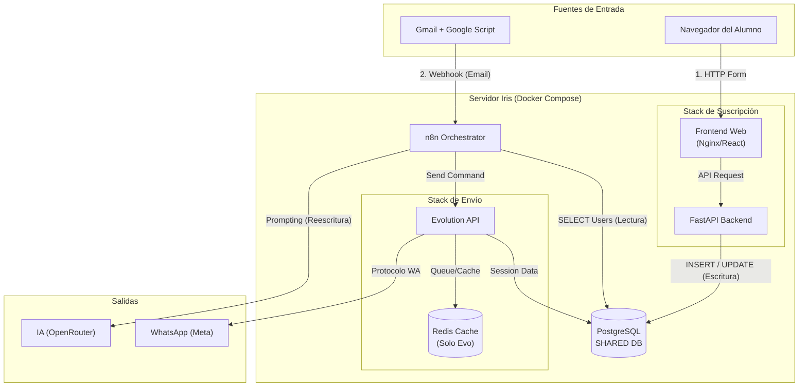

## Organización de Puertos

Para facilitar el desarrollo y evitar conflictos, se establece la siguiente asignación de puertos para los servicios en entorno local (Docker Host):

| Servicio | Tecnología | Puerto Interno (Container) | Puerto Externo (Host) | Descripción |
| :--- | :--- | :--- | :--- | :--- |
| **Frontend** | Astro | `4321` | **4321** | Interfaz de usuario web (Dev/Preview). |
| **Backend** | FastAPI (Python) | `8000` | **8000** | API REST principal. |
| **Base de Datos** | PostgreSQL | `5432` | **5432** | Persistencia de datos relacional. |
| **Orquestador** | n8n | `5678` | **5678** | Automatización de flujos. |
| **WhatsApp API** | Evolution API | `8080` | **8081** | Gateway de WhatsApp (Mapeado a 8081 para evitar conflictos comunes en 8080). |
| **Cache** | Redis | `6379` | - | Cola de mensajes y caché (Solo uso interno). |

*Nota: Asegúrese de que estos puertos no estén ocupados por otros servicios en su máquina local antes de levantar el entorno. Los servicios marcados con "-" en el puerto externo no deben ser expuestos al host por seguridad y coherencia.*