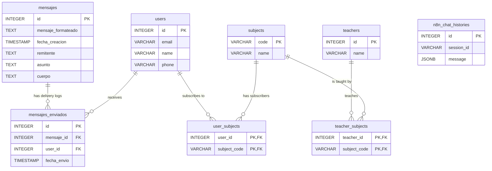

```mermaid
erDiagram
    users {
        INTEGER id PK
        VARCHAR email
        VARCHAR name
        VARCHAR phone
    }

    subjects {
        VARCHAR code PK
        VARCHAR name
    }

    teachers {
        INTEGER id PK
        VARCHAR name
    }

    user_subjects {
        INTEGER user_id PK, FK
        VARCHAR subject_code PK, FK
    }

    teacher_subjects {
        INTEGER teacher_id PK, FK
        VARCHAR subject_code PK, FK
    }

    mensajes {
        INTEGER id PK
        TEXT mensaje_formateado
        TIMESTAMP fecha_creacion
        TEXT remitente
        TEXT asunto
        TEXT cuerpo
    }

    mensajes_enviados {
        INTEGER id PK
        INTEGER mensaje_id FK
        INTEGER user_id FK
        TIMESTAMP fecha_envio
    }

    n8n_chat_histories {
        INTEGER id PK
        VARCHAR session_id
        JSONB message
    }

    %% Relationships
    users ||--o{ user_subjects : "subscribes to"
    subjects ||--o{ user_subjects : "has subscribers"

    teachers ||--o{ teacher_subjects : "teaches"
    subjects ||--o{ teacher_subjects : "is taught by"

    mensajes ||--o{ mensajes_enviados : "has delivery logs"
    users ||--o{ mensajes_enviados : "receives"
```
